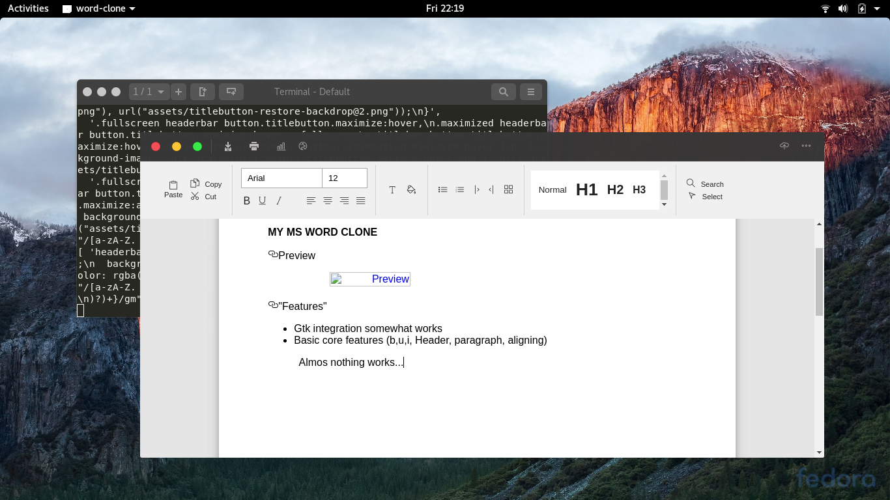
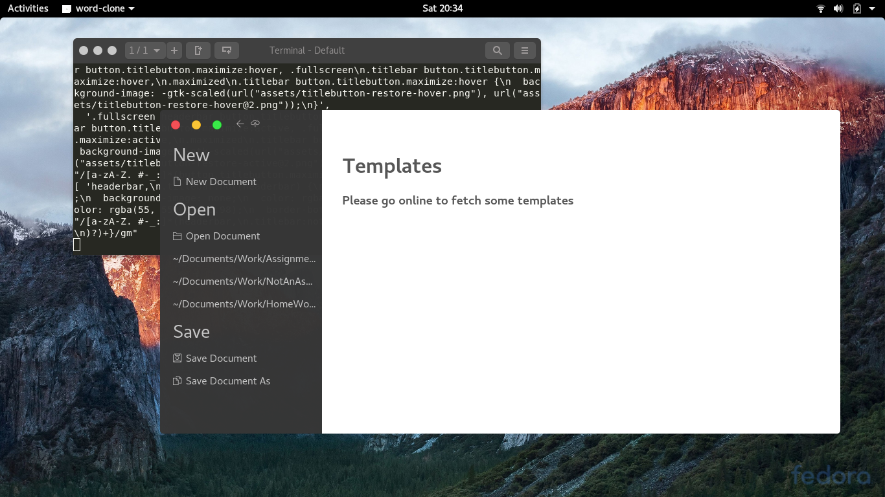

# Word Clone [](https://travis-ci.org/raggesilver/word)
(it doesn't have a name yet)

### Screenshot(s)
**Editor**

Can't paste images :(

**Landing page concept**

I am online :P

### Install & run

Standard

```bash
npm i # Install the required dependencies
npm run start # No integration
```

Running on Linux and debugging

```bash
npm run start-linux # Basic GTK integration if running Gnome
npm run start-lunux-debug # Complete Gtk integration + degug mode enabled
```

### Todo
- FIND A NEW ICON SET!!!
- Finish core features
- Figure a way to do tabbing better than Microsoft
- Improve Gtk integration
- Do paging
- Build components (eg.: color picker, font chooser)
- Create different pages (eg.: landing, save, online account integration )
- Give up

Almost nothing works...
