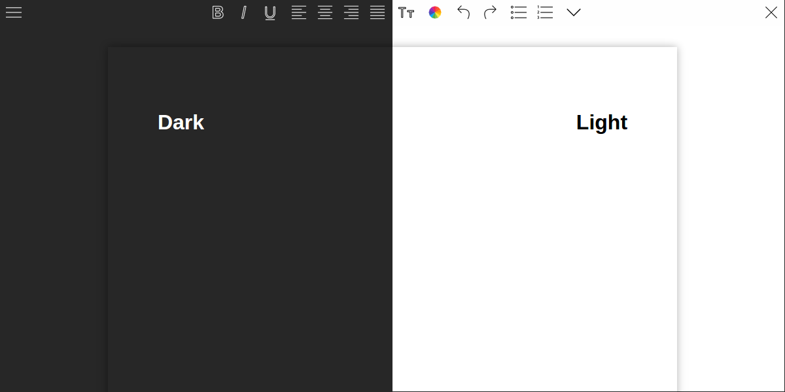

# WYSIWYG

WYIWYG html editor written in Javascrip + HTML.

**Preview:** 

## Features

* Crappy Ctrl + S save function (not that bad anymore)
* Even crappier Ctrl + O open function (not that bad anymore)
* Not bad compatibility with text copied from LibreOffice (a bit worse when copied from MS Office)
* Standard text formatting functions
* Print
* Drag and Drop file oppening (only own files)
* No distraction mode
* Dark theme
* Recover files ("continue from where I left")

## Coming soon

* Css selector
* More fonts and colors
* Background image

## Coming **not** soon

* Spell checker
* "Continue from where I left" (with saved files)
* Dropbox integration

## Credits

Icon pack by [Icons8](https://icons8.com)
