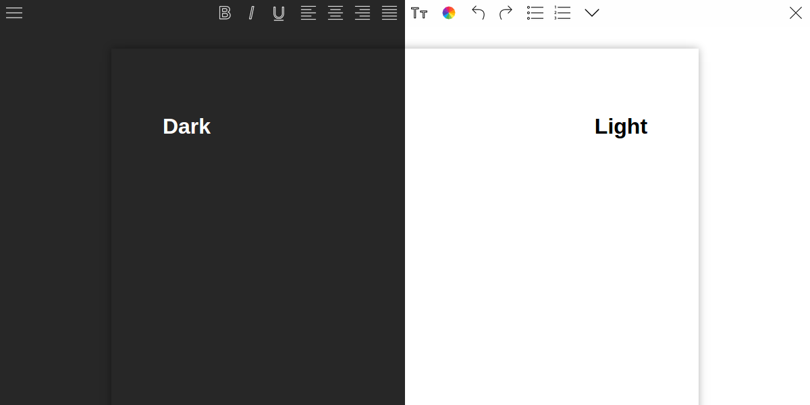

# WYSIWYG

Simple word processor written in JavaScript, built with electron! The main objective is to provide a decent editor with a clean UI - without lack of functionality. Please help us by testing and reporting bugs :D


**Preview:** 

## Features

* Save, Open, Print (all with keyboard shortcuts)
* Not bad compatibility with text copied from LibreOffice (a bit worse when copied from MS Office)
* Standard text formatting functions
* Drag and Drop file oppening (only own files)
* No distraction mode
* Dark theme
* Recover files ("continue from where I left")

## Coming soon

* Css selector
* More fonts and colors
* Background image
* Spell checker
* "Continue from where I left" (with saved files)
* Dropbox integration
* Paging

## Changelog (28 Jun)

* Working on **table functions**
* Planing **animations for color selection** and button fixing
* Improving dark theme (which seems to be breaking ```-webkit-app-region: drag```)
* Searching for workarround for mac shortcut issues
* Aware of **broken recover function on Windows**

## Installation

For Ubuntu and MAC make sure Node and NPM are installed, then clone and execute "compile.sh" or:
```bash
npm install
npm start
```

## Credits

Icon pack by [Icons8](https://icons8.com)

Css and Dark Theme by [SimonLight](https://github.com/SimonLight001)
