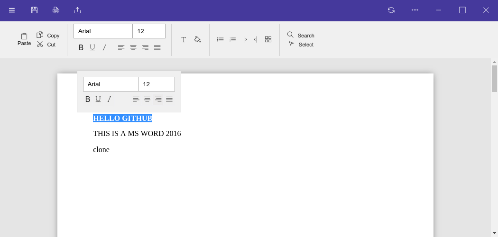

# My MS Word clone

### Preview

### "Features"

- Kind of "detects" gtk theme and copies the necessary css to make the window actions look like the user's selected theme (only works on gnome tho)

Absolutly nothing works... yet
