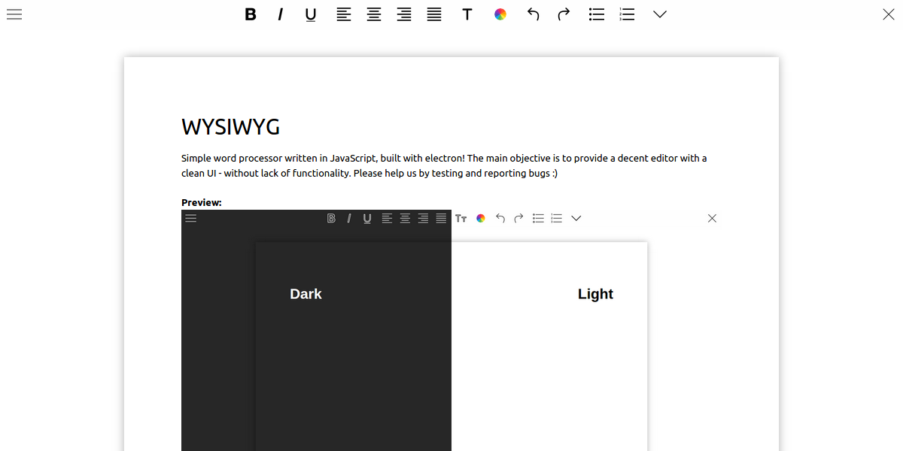

# WYSIWYG

Simple word processor written in JavaScript, built with electron! The main objective is to provide a decent editor with a clean UI - without lack of functionality. Please help us by testing and reporting bugs :)


**Preview:** 

## Features

* Save, Open, Print (all with keyboard shortcuts)
* Not bad compatibility with text copied from LibreOffice (a bit worse when copied from MS Office)
* Standard text formatting functions
* Drag and Drop file oppening (only own files)
* No distraction mode
* Dark theme
* Standard table functions

## To-do

* Css selector
* More fonts and colors
* Background image
* Spell checker
* "Continue from where I left" (with saved files)
* Dropbox integration
* Paging

## Changelog (01 Jul)

* Added table and table tools
* Failed to migrate from electron 0.25.1 to lastest version
* Aware of drag and drop bug (overwrites the whole editor)
* Aware of broken shortcuts on MAC (apparently only on Mac Book Air)
* Discontinued supporting Windows (until problems in Ubuntu and OS X are solved)

Complete changelog [here](https://github.com/raggesilver/WYSIWYG/blob/daily/README.md).

## Installation

For Ubuntu and OS X make sure Node and npm are installed, then clone and execute "compile.sh" or:
```bash
npm install
npm start
```

## Credits

Icon pack by [Icons8](https://icons8.com).

"colours.css" and Dark Theme improvements by [SimonLight](https://github.com/SimonLight001).
