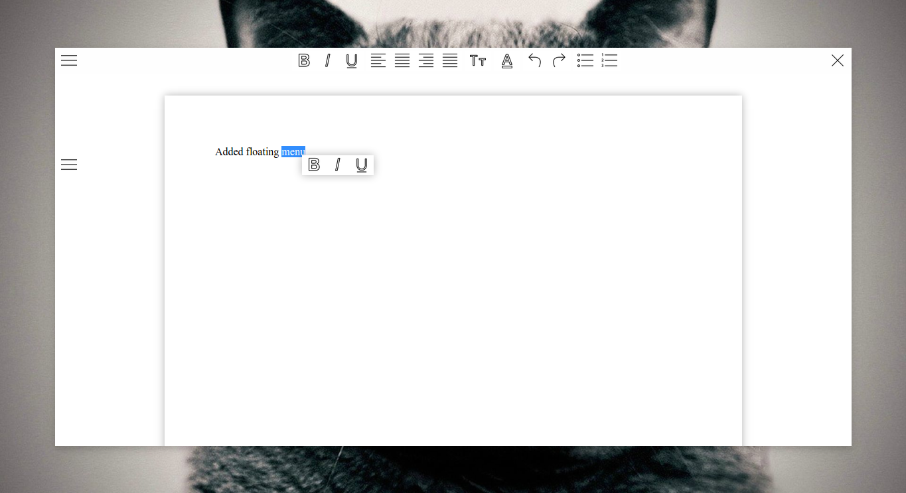

# WYSIWYG

WYIWYG html editor written in Javascrip + HTML.

**Preview:** 

## Features

* Crappy Ctrl + S save function
* Even crappier Ctrl + O open function
* Not bad compatibility with text copied from LibreOffice (a bit worse when copied from MS Office)
* Standard text formatting functions
* Print
* Drag and Drop file oppening
* No distraction mode

## Credits

Icon pack by [Icons8](https://icons8.com)
