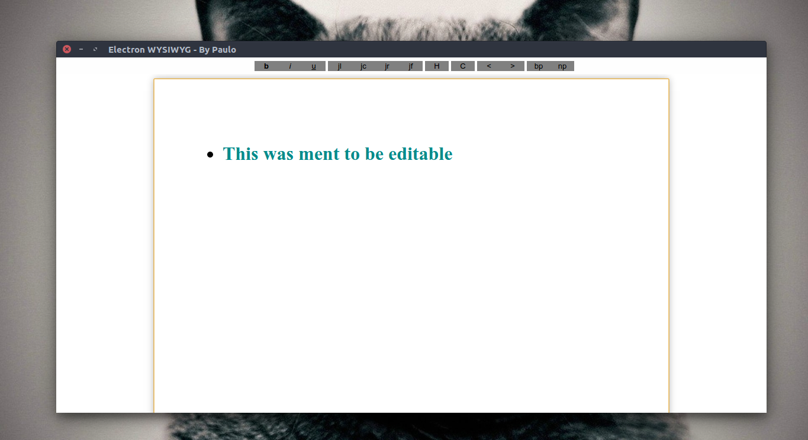

# WYSIWYG

WYIWYG html editor written in Javascrip + HTML.

**Preview:** 

## Features

* Crappy Ctrl + S save function
* Even crappier Ctrl + O open function
* Not bad compatibility with text copied from LibreOffice (not tested with MS Office)
* Standard text formatting functions
* Print
* Drag and Drop file oppening
* No distraction mode

## Changelog

#### v0.0.0.1

Added Drag and Drop Support. (totally insecure since it does not ask to save the current document before opening the droped file)
Incomming custom css file chooser.
Frameless Window
